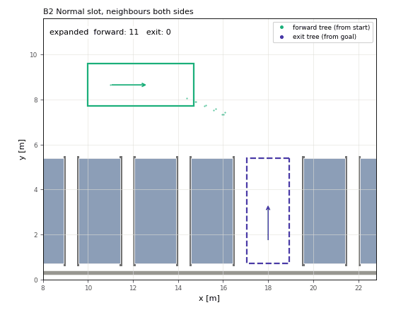
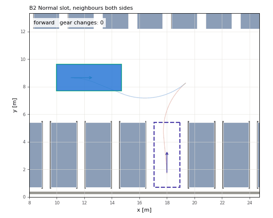

# State Lattice Auto Parking Planner

A parking path planner based on state lattice search, written in Python as the reference implementation for a C++ / Autoware port.

| Search (forward tree + exit tree) | Result (one gear change) |
|---|---|
|  |  |

- **Input**: vehicle parameters (Autoware `VehicleInfo`), 2D occupancy grid, start / goal pose (rear-axle centre)
- **Output**: a collision-free, kinematically feasible trajectory (x, y, yaw, direction, steering, curvature, arc_length)
- **Design goal**: only paths a customer would accept — normally a single gear change, no back-and-forth shuffling

## Usage

```bash
pip install -r requirements.txt           # Python 3.10+, numba strongly recommended
python parking_demo.py --id B2            # plan and show one scenario (ids: scenarios.py)
python parking_demo.py --id B2 --gif docs/parking.gif --search-gif docs/search.gif
python run_tests.py --all --random 100    # tests + product spec + benchmark -> results/summary.txt
python run_tests.py --regression          # deterministic regression check
python -m pytest tests -q                 # unit / property tests
```

Heuristic tables are built on first use and cached in `.cache/`.

## Product specification

All 154 fixed and random scenes with a specification meet it (`run_tests.py --all --random 100`).

| Item | Specification |
|---|---|
| Gear changes | perpendicular: 1; narrow slot (pitch < 2.5 m or aisle < 6 m): up to 3 |
| | parallel: 1 if space ≥ 1.6 × vehicle length, up to 2 if ≥ 1.45 ×; otherwise up to 3 or rejection |
| | obstacle avoidance / open space: 0 |
| Manoeuvre length | ≥ 1.0 m before a gear change in the aisle, ≥ 0.4 m near the slot |
| Steering | each steering direction held ≥ 0.3 m (no steering spikes) |
| Safety margin | 0.1 m guaranteed over the continuous motion (longitudinal / lateral configurable) |
| Goal accuracy | ≤ 0.10 m, ≤ 2° |
| Compute | ≤ 100k expansions (hard: 200k); infeasible scenes are rejected within the budget |

## Algorithm

- **Search** (`state_lattice.py`, `maneuver.py`)
  - Weighted A*. The state is (x, y, yaw, gear, gear changes so far, manoeuvre-length class).
  - The gear-change limit and the minimum manoeuvre length are hard constraints, not costs.
  - Motion primitives are generated from the vehicle parameters (`motion_primitives.py`).
  - The goal is connected exactly with Reeds-Shepp curves.
- **Bidirectional** (`parking_planner.py`, `meet.py`)
  - A forward search (start → goal) and an exit search (goal → start, on a finer lattice, time-reversed) run alternately.
  - When the two trees come close, they are joined with a Reeds-Shepp curve (meet-in-the-middle).
  - A path with 2 or more gear changes is re-planned with one change fewer.
- **Heuristic** (`heuristic.py`, `lattice_heuristic.py`)
  - The max of a free-space lattice cost-to-go table (per remaining gear changes) and an obstacle-aware 2D Dijkstra.
  - The 2D Dijkstra's ∞ is a sound proof of unreachability.
- **Collision checking** (`collision_checker.py`, `_accel.py`)
  - Exact oriented-rectangle vs. grid-cell test (SAT); a distance field decides most cases up front.
  - numba and numpy implementations are cross-checked.
- **Post-processing** (`path_shortcut.py`): Reeds-Shepp shortcuts that keep all rules and never add gear changes.

## Limitations

- Python is slow: hard scenes take tens of seconds. A C++ port is assumed for production.
- Very narrow perpendicular slots take 3 gear changes. Entering the aisle forward and reversing in allows only 1 or 3 changes, never 2.
- Dead ends and turning in a box (D4, D5) are rejected only after the expansion budget is used up.
- Steering is piecewise constant (no clothoids, no steering-rate model).

## Porting notes

- Keep the invariants checked by `tests/`:
  - exact collision checking
  - continuous margin guarantee
  - soundness of the unreachability proof
  - HLUT matches the reference Dijkstra
  - manoeuvre rules
  - determinism
- Python `%` / `floor` differ from C++ for negative values.
- Treat NaN poses as collisions.

## License

Apache License 2.0 (see [LICENSE](LICENSE)).
